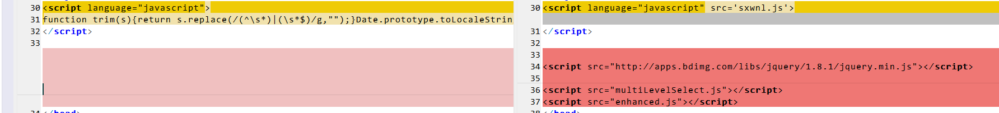

# sxwnl_enhanced

#### 介绍
以寿星万年历为基础，做了年号增强，主要是基于寿星万年历中，obb.JNB的数据进行二次增强。

效果如图：

遵循寿星万年历的提示，尽可能的少改动sxwnl本身，故此，主要修改都集中在 **enhanced.js** 中。

#### 软件架构

基于[MultiLevelSelect](https://github.com/chienhungchen/MultiLevelSelect)
和JQ 1.8.X开发。
JQ使用百度加速： http://apps.bdimg.com/libs/jquery/1.8.1/jquery.min.js

#### 安装教程

点击[下载](https://gitee.com/gavinkou/sxwnl_enhanced/archive/refs/tags/v1.1.zip) [v1.1](https://gitee.com/gavinkou/sxwnl_enhanced/archive/refs/tags/v1.1.zip)

解压后，可得四个文件：

1. sxwnlV5.10.html
1. enhanced.js
1. multiLevelSelect.js
1. sxwnl.js

以上四个文件，下载至同一目录，然后用浏览器，打开 **sxwnlV5.10.html** 即可。

